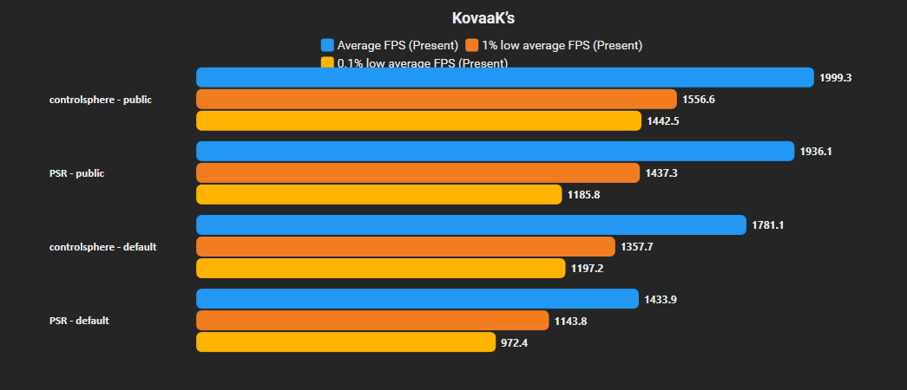

# My collection of KovaaK's resources

At the moment the repository only includes an optimized `Engine.ini`, but more content will be added, maybe.

---

## Engine.ini

### Overview

Current `Engine.ini` focuses on reducing unnecessary UE4 rendering overhead and improving frame consistency. I have tested it only on AMD CPU's.

### Tested on

- AMD Ryzen 7 9800X3D
- RTX 4080 Super
- 32 GB DDR5-6000 CL30
- Windows 10.0.26100 Build 26100

### Tools

- CapFrameX

### Results
PSR = pasu small reload  

main = this config  
none = clean Engine.ini  
new = don't mind it  

<p align="center">
  
</p>

Your results WILL vary. 

### Installation

Copy:

```
configs/Engine.ini
```

to

```
%LOCALAPPDATA%\FPSAimTrainer\Saved\Config\WindowsNoEditor
```

Replace your existing `Engine.ini`.

It's recommended to make a backup first. If anything goes wrong, just delete the custom file and KovaaK's will generate a clean one on next launch.

**You HAVE TO set the file to **Read only**, you don't want the game to overwrite it.**

### Lower latency

The included config is mainly aimed at improving performance and frame consistency.
If you want to prioritize lower latency instead, try changing:

```ini
r.OneFrameThreadLag=0
```

For a more aggressive approach you can also test:

```ini
r.FinishCurrentFrame=1
r.GTSyncType=1
r.RHI.MaximumFrameLatency=1
```

As always, test what works best on your own system.

### Notes

- Properly tested only on AMD Ryzen CPUs, it caused crashes on Intel systems.
- Intel compatibility is not the greatest, some settings will cause crashes or instability.
- Not every CVar has been individually tested. Some are probably redundant or have no measurable effect, but they're left in until I can verify them properly (it will never happen).
- Occasional crashes can happen when alt-tabbing while your cursor is hovering over an item in the UI. If those crashes are too much for you set `Slate.EnableGlobalInvalidation` to `0`, but you will lose some frames. It also causes some minot text artifacts.

---

## Planned
- More stuff
