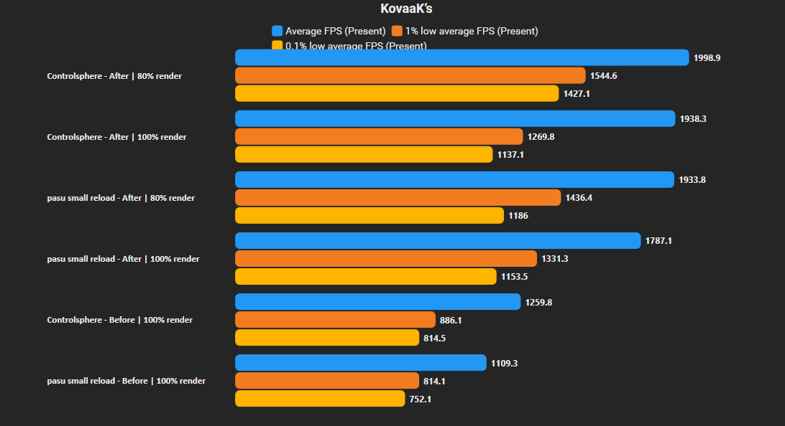
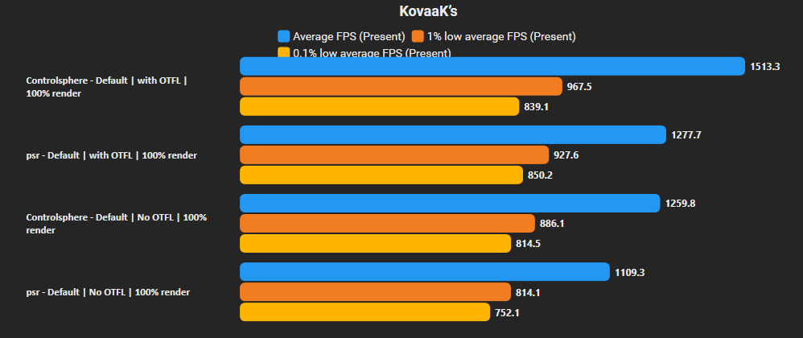
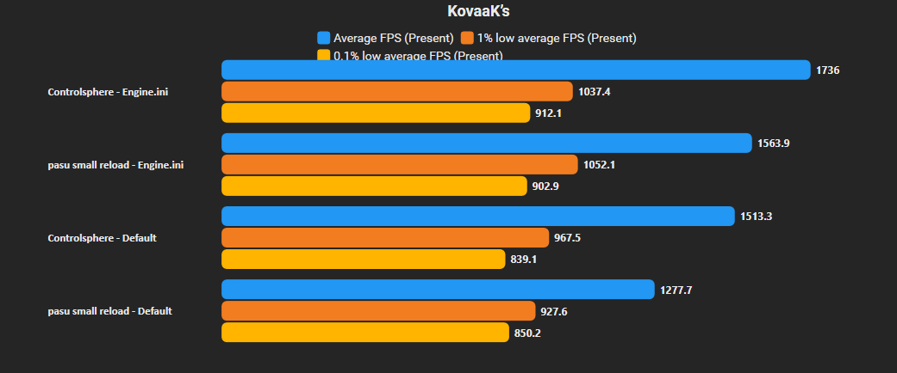
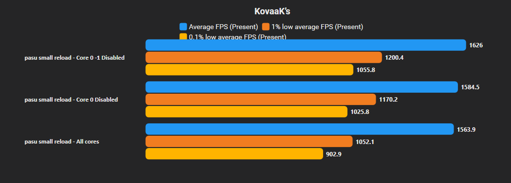
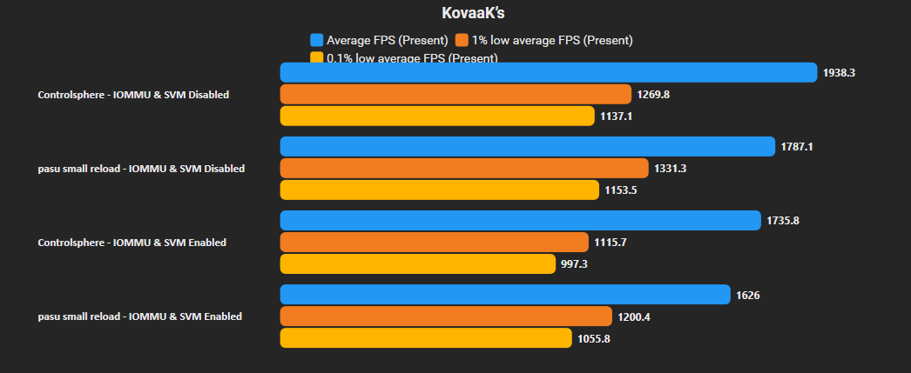
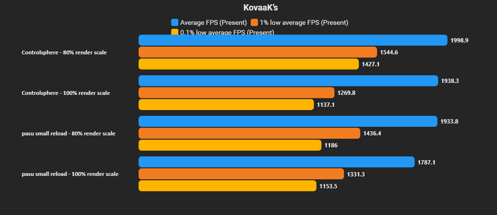

# KovaaK's performance tweaks

Everything below was tested on my AMD system. A different AMD CPU, SMT setup, or any Intel CPU WILL behave differently, so treat these results as a reference and test the tweaks yourself.

## Test system

- Ryzen 7 9800X3D
- RTX 4080 Super
- 32 GB DDR5-6000 CL30
- 2560x1440 native res
- Windows 11 Pro build 26100 Atlas OS 
- Benchmark tool - CapFrameX

## Stock vs. final setup

  

#### pasu small reload

| Metric      | Stock   | Tweaked - 100% render | Tweaked - 80% render |
| ----------- | -------:| ---------------------:| --------------------:|
| Average FPS | 1,109.3 | 1,787.1 (+61.1%)      | 1,933.8 (+74.3%)     |
| 1% low      | 814.1   | 1,331.3 (+63.5%)      | 1,436.4 (+76.4%)     |
| 0.1% low    | 752.1   | 1,153.5 (+53.4%)      | 1,186.0 (+57.7%)     |

#### Controlsphere

| Metric      | Stock   | Tweaked - 100% render | Tweaked - 80% render |
| ----------- | -------:| ---------------------:| --------------------:|
| Average FPS | 1,259.8 | 1,938.3 (+53.9%)      | 1,998.9 (+58.7%)     |
| 1% low      | 886.1   | 1,269.8 (+43.3%)      | 1,544.6 (+74.3%)     |
| 0.1% low    | 814.5   | 1,137.1 (+39.6%)      | 1,427.1 (+75.2%)     |

Each comparison uses the better (higher lows) setting from the previous step. 

Test changes one at a time.

## 1. One Thread Frame Lag

Open Video settings and enable One Thread Frame Lag. This is the starting point for every next benchmark. 

Personally I don't feel any difference when it comes to the input lag, I've been playing with OTFL for a long time, maybe I've just got used to it. 

  

#### pasu small reload

| Metric      | Off     | On      | Change |
| ----------- | -------:| -------:| ------:|
| Average FPS | 1,109.3 | 1,277.7 | +15.2% |
| 1% low      | 814.1   | 927.6   | +13.9% |
| 0.1% low    | 752.1   | 850.2   | +13.0% |

#### Controlsphere

| Metric      | Off     | On      | Change |
| ----------- | -------:| -------:| ------:|
| Average FPS | 1,259.8 | 1,513.3 | +20.1% |
| 1% low      | 886.1   | 967.5   | +9.2%  |
| 0.1% low    | 814.5   | 839.1   | +3.0%  |

## 2. Engine.ini

Copy [configs/Engine.ini](configs/Engine.ini) to `%LOCALAPPDATA%\FPSAimTrainer\Saved\Config\WindowsNoEditor`, replace the existing file, then set it to read-only. [The Engine.ini "guide"](engine-ini.md) has the backup step and common fixes.

  

#### pasu small reload

| Metric      | Stock Engine.ini | Config  | Change |
| ----------- | ----------------:| -------:| ------:|
| Average FPS | 1,277.7          | 1,563.9 | +22.4% |
| 1% low      | 927.6            | 1,052.1 | +13.4% |
| 0.1% low    | 850.2            | 902.9   | +6.2%  |

#### Controlsphere

| Metric      | Stock Engine.ini | Config  | Change |
| ----------- | ----------------:| -------:| ------:|
| Average FPS | 1,513.3          | 1,736.0 | +14.7% |
| 1% low      | 967.5            | 1,037.4 | +7.2%  |
| 0.1% low    | 839.1            | 912.1   | +8.7%  |

## 3. CPU affinity

First, open Task Manager, then Performance, then CPU. Check `Logical processors` and leave every CPU enabled except CPU 0 and CPU 1. 

Intel, P/E-core systems, 8 or 32 threads - it all neds its own testing. Disablind 0-1 should be fine for most 8 cores 16 threads AMD cpus. 

Use one of these methods:

1. Process Lasso: start KovaaKs, right-click `FPSAimTrainer-Win64-Shipping.exe`, select `CPU Affinity` -> `Always` -> `Select`. Untick CPU 0 and CPU 1, then apply.
2. Process Governor: download the [latest release](https://github.com/SystemXFiles/process-governor/releases/latest), run it as administrator, find `FPSAimTrainer-Win64-Shipping.exe` , right-click it, and choose `Add Process Rule`. Set `Selector By` to `Name`, `Affinity` to the range for your CPU, such as `2-15`, set `Force` to `Y`, then save.

  

#### pasu small reload

| Metric      | All cores | CPU 0 disabled   | CPU 0-1 disabled |
| ----------- | ---------:| ----------------:| ----------------:|
| Average FPS | 1,563.9   | 1,584.5 (+1.3%)  | 1,626.0 (+4.0%)  |
| 1% low      | 1,052.1   | 1,170.2 (+11.2%) | 1,200.4 (+14.1%) |
| 0.1% low    | 902.9     | 1,025.8 (+13.6%) | 1,055.8 (+16.9%) |

## 4. Disable SVM and IOMMU

Those are bios options, every motherboard has them in a different place so you have to find them on your own.

If you play Faceit/ Valorant (Leauge of Legens too I think, since the AC update) you have to have both of those settings ON, you won't be able to play without them. 

  

#### pasu small reload

| Metric      | Enabled | Disabled | Change |
| ----------- | -------:| --------:| ------:|
| Average FPS | 1,626.0 | 1,787.1  | +9.9%  |
| 1% low      | 1,200.4 | 1,331.3  | +10.9% |
| 0.1% low    | 1,055.8 | 1,153.5  | +9.3%  |

#### Controlsphere

| Metric      | Enabled | Disabled | Change |
| ----------- | -------:| --------:| ------:|
| Average FPS | 1,735.8 | 1,988.3  | +14.5% |
| 1% low      | 1,115.7 | 1,269.8  | +13.8% |
| 0.1% low    | 997.3   | 1,137.1  | +14.0% |

## 5. Render scale

If you don't mind a slightly softer image (I wouldn't call it blurry, at least when you use normal values) you should try lowering your render scale a bit. It can help quite a bit without degrading the quality that much (if you are on 1440p+, I haven't tested in on lower native resolutions).

  

#### pasu small reload

| Metric      | 100% render scale | 80% render scale | Change |
| ----------- | -----------------:| ----------------:| ------:|
| Average FPS | 1,787.1           | 1,933.8          | +8.2%  |
| 1% low      | 1,331.3           | 1,436.4          | +7.9%  |
| 0.1% low    | 1,153.5           | 1,186.0          | +2.8%  |

#### Controlsphere

| Metric      | 100% render scale | 80% render scale | Change |
| ----------- | -----------------:| ----------------:| ------:|
| Average FPS | 1,938.3           | 1,998.9          | +3.1%  |
| 1% low      | 1,269.8           | 1,544.6          | +21.6% |
| 0.1% low    | 1,137.1           | 1,427.1          | +25.5% |

## Final words

Your hardware, system optimizations and other stuff WILL change the result. Test one tweak at a time and keep only what makes a real difference for you.
